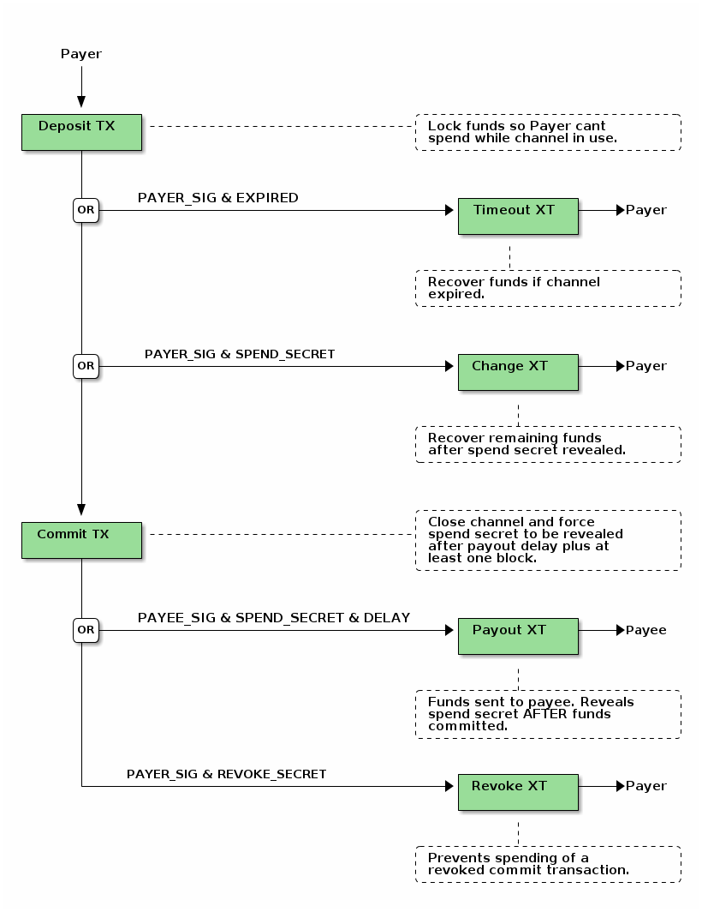

############
PicoPayments
############

|BuildLink|_ |CoverageLink|_ |LicenseLink|_ |IssuesLink|_

.. |BuildLink| image:: https://travis-ci.org/Storj/picopayments.svg
.. _BuildLink: https://travis-ci.org/Storj/picopayments

.. |CoverageLink| image:: https://coveralls.io/repos/Storj/picopayments/badge.svg
.. _CoverageLink: https://coveralls.io/r/Storj/picopayments

.. |LicenseLink| image:: https://img.shields.io/badge/license-MIT-blue.svg
.. _LicenseLink: https://raw.githubusercontent.com/F483/picopayments/master/LICENSE

.. |IssuesLink| image:: https://img.shields.io/github/issues/F483/picopayments.svg
.. _IssuesLink: https://github.com/F483/picopayments/issues

Trustless micropayment channels for counterparty assets ᕕ( ᐛ )ᕗ

============
Installation
============

::

  pip install picopayments

=====
Usage
=====

---------------------
Fast native functions
---------------------

There is experimental code that will call into OpenSSL for slow functions.
To enable this, set (and export) environment variable PYCOIN_NATIVE=openssl.

::

  $ export PYCOIN_NATIVE=openssl

======================
Counterparty API Calls
======================

See _`examples` or _`tests` for usage.

-------------
Channel State
-------------

::

    INITIAL_STATE = {
        "asset": None,

        "deposit_script": None,

        # Quantity not needed as payer may change it. If its heigher its
        # against our self intrest to throw away money. If its lower it
        # gives us a better resolution when reversing the channel.
        "commits_requested": [],  # ["revoke_secret_hash"]

        # must be ordered lowest to heighest at all times!
        "commits_active": [],     # [{
        #                             "rawtx": hex,
        #                             "script": hex,
        #                           }]

        "commits_revoked": [],    # [{
        #                             "script": hex,
        #                             "revoke_secret": hex
        #                           }]
    }

----------------
mpc_make_deposit
----------------

::

    Create deposit and setup initial payer state.

    Args:
        asset (str): Counterparty asset.
        payer_pubkey (str): Hex encoded public key in sec format.
        payee_pubkey (str): Hex encoded public key in sec format.
        spend_secret_hash (str): Hex encoded hash160 of spend secret.
        expire_time (int): Channel expire time in blocks given as int.
        quantity (int): Asset quantity for deposit.

    Returns:
        {
            "state": channel_state,
            "topublish": unsigned_deposit_rawtx,
            "deposit_script": hex_encoded
        }

    Raises:
        counterpartylib.lib.micropayments.exceptions.InvalidHexData
        counterpartylib.lib.micropayments.exceptions.InvalidPubKey
        counterpartylib.lib.micropayments.exceptions.InvalidHash160
        counterpartylib.lib.micropayments.exceptions.InvalidSequence
        counterpartylib.lib.micropayments.exceptions.InvalidQuantity
        counterpartylib.lib.micropayments.exceptions.InsufficientFunds
        counterpartylib.lib.micropayments.exceptions.ChannelAlreadyUsed

---------------
mpc_set_deposit
---------------

::

    Setup initial payee state for given deposit.

    Args:
        asset (str): Counterparty asset.
        deposit_script (str): Channel deposit p2sh script.
        expected_payee_pubkey (str): To validate deposit for payee.
        expected_spend_secret_hash (str): To validate deposit secret hash.

    Returns: {"state": updated_state}

    Raises:
        counterpartylib.lib.micropayments.exceptions.InvalidHexData
        counterpartylib.lib.micropayments.exceptions.InvalidPubKey
        counterpartylib.lib.micropayments.exceptions.InvalidDepositScript
        counterpartylib.lib.micropayments.exceptions.IncorrectPubKey
        counterpartylib.lib.micropayments.exceptions.IncorrectSpendSecretHash

------------------
mpc_request_commit
------------------

::

     Request commit for given quantity and revoke secret hash.

     Args:
         state (dict): Current payee channel state.
         quantity (int): Asset quantity for commit.
         revoke_secret_hash (str): Revoke secret hash for commit.

     Returns:
         {
             "state": updated_channel_state,
             "quantity": quantity,
             "revoke_secret_hash": revoke_secret_hash
         }

     Raises:
         counterpartylib.lib.micropayments.exceptions.InvalidState
         counterpartylib.lib.micropayments.exceptions.InvalidHash160
         counterpartylib.lib.micropayments.exceptions.InvalidQuantity
         ValueError

-----------------
mpc_create_commit
-----------------

::

    Create commit for given quantit, revoke secret hash and delay time.

    Args:
        state (dict): Current payer channel state.
        quantity (int): Asset quantity for commit.
        revoke_secret_hash (str): Revoke secret hash for commit.
        delay_time (int): Blocks payee must wait before payout.

    Returns:
        {
            "state": updated_channel_state,
            "commit_script": hex_encoded,
            "tosign": {
                "rawtx": unsigned_commit_rawtx,
                "deposit_script": hex_encoded
            }
        }

    Raises:
        counterpartylib.lib.micropayments.exceptions.InvalidState
        counterpartylib.lib.micropayments.exceptions.InvalidQuantity
        counterpartylib.lib.micropayments.exceptions.InvalidHash160
        counterpartylib.lib.micropayments.exceptions.InvalidSequence
        ValueError

--------------
mpc_add_commit
--------------

::

    Add commit to channel state.

    Args:
        state (dict): Current payee channel state.
        commit_rawtx (str): Commit transaction signed by payer.
        commit_script (str): Commit p2sh script.

    Returns: {"state": updated_state}

    Raises:
        counterpartylib.lib.micropayments.exceptions.InvalidHexData
        counterpartylib.lib.micropayments.exceptions.InvalidState
        counterpartylib.lib.micropayments.exceptions.IncorrectPubKey
        counterpartylib.lib.micropayments.exceptions.IncorrectSpendSecretHash

------------------------------
mpc_revoke_secret_hashes_above
------------------------------

::

    Get revoke secret hashes for commits above the given quantity.

    Args:
        state (dict): Current payee channel state.
        quantity (int): Return revoke secret hash if commit gt quantity.

    Returns: List of hex encoded revoke secret hashes.

    Raises:
        counterpartylib.lib.micropayments.exceptions.InvalidState
        counterpartylib.lib.micropayments.exceptions.InvalidQuantity

--------------
mpc_revoke_all
--------------

::

    Revoke all commits matching the given secrets.

    Args:
        state (dict): Current payee/payer channel state.
        secrets (list): List of hex encoded commit revoke secrets.

    Returns: {"state": updated_state}

    Raises:
        counterpartylib.lib.micropayments.exceptions.InvalidState

------------------
mpc_highest_commit
------------------

::

    Get highest commit be signed/published for closing the channel.

    Args:
        state (dict): Current payee channel state.

    Returns:
        If no commits have been made:
            None

        If commits have been made:
            {
                "commit_rawtx": half_signed_commit_rawtx,
                "deposit_script": hex_encoded
            }

    Raises:
        counterpartylib.lib.micropayments.exceptions.InvalidState

----------------------
mpc_transferred_amount
----------------------

::

    Get asset quantity transferred from payer to payee.

    Args:
        state (dict): Current payee/payer channel state.

    Returns:
        Quantity transferred in satoshis.

    Raises:
        counterpartylib.lib.micropayments.exceptions.InvalidState

-----------
mpc_payouts
-----------

::

    Find published commits and make payout transactions.

    Args:
        state (dict): Current payee channel state.

    Returns:
        [{
            "payout_rawtx": unsigned_rawtx,
            "commit_script": hex_encoded
        }]

    Raises:
        counterpartylib.lib.micropayments.exceptions.InvalidState

----------------
mpc_recoverables
----------------

::

    Find and make recoverable change, timeout and revoke transactions.

    Args:
        state (dict): Current payee channel state.

    Returns:
        {
            "change":[{
                "change_rawtx": unsigned_rawtx,
                "deposit_script": hex_encoded,
                "spend_secret": hex_encoded
            }],
            "expire":[{
                "expire_rawtx": unsigned_rawtx,
                "deposit_script": hex_encoded
            }],
            "revoke":[{
                "revoke_rawtx": unsigned_rawtx,
                "commit_script": hex_encoded,
                "revoke_secret": hex_encoded
            }]
        }

    Raises:
        counterpartylib.lib.micropayments.exceptions.InvalidState

========
Protocol
========

-------------------
Deposit Transaction
-------------------

The deposit transaction ensures the payee cannot spend the funds while
the channel is open.

The pay to script allows for three possible outcoms:

 - The payer can recover the deposit after a timeout if no commit was made.
 - Both parties commit and close the channel.
 - The payer collects the change after the payee publishes the spend secret.

**The commit transaction spend secret must be the same as the deposit
transaction spend secret!**

pay to script:

::

    OP_IF
        2 <payer pubkey> <payee pubkey> 2 OP_CHECKMULTISIG
    OP_ELSE
        OP_IF
            OP_HASH160 <spend secret hash> OP_EQUALVERIFY
            <payer pubkey> OP_CHECKSIG
        OP_ELSE
            <expire time> OP_CHECKSEQUENCEVERIFY OP_DROP
            <payer pubkey> OP_CHECKSIG
        OP_ENDIF
    OP_ENDIF

------------------
Expire Transaction
------------------

The expire transaction is used by the payee to recover the and funds after
the channel expires. This is to prevent funds being lost should the payee
be hit by a bus.

script sig:

::

    <payer signature> OP_FALSE OP_FALSE

    # Proof/example: 796637e788db8d3430ae48ec057ef493a871b7abc4711f9bb5f6148efc2212e7

------------------
Change Transaction
------------------

After the commit transaction has been published on the blockchain, the
payee must reveal the spend secret to spend the committed funds. The payer
can then recover the change from the channel before it times out by using the
revealed spend secret.

script sig:

::

    <payer signature> <spend secret> OP_TRUE OP_FALSE

    # Proof/example: a6fdd23b2e5b1153cbd358c362456263531451b80ab4a597f7aa122cecc52703

------------------
Commit Transaction
------------------

The commit transaction is used to transfer funds and prevent a race condition
between the payee recovering the payout and the payer recovering the change.

Every time the payer wishes to transfer funds to the payee, the output amount
of the transaction is increased. The payee then signs and shares it.

To ensure the payer can recover the change without having to wait for the
channel to expire, the payee must reveal the spend secret when spending the
payout. **The commit transaction spend secret must be the same as the deposit
transaction spend secret!**

The transaction also enables spending by the payer if the transaction was
revoked by the payee (revealed the revolk signature). This prevents the payee
from publishing a revoked transaction.

script sig:

::

    OP_FALSE <payer signature> <payee signature> OP_TRUE

    # Proof/example: 34f7abf7474de02abdbff63e1718477d33c20d457e9881e2087c3d79f6517d1c

pay to script:

::

    OP_IF
        <delay time> OP_CHECKSEQUENCEVERIFY OP_DROP
        OP_HASH160 <spend secret hash> OP_EQUALVERIFY
        <payee pubkey> OP_CHECKSIG
    OP_ELSE
        OP_HASH160 <revoke secret hash> OP_EQUALVERIFY
        <payer pubkey> OP_CHECKSIG
    OP_ENDIF

------------------
Payout Transaction
------------------

The payout transaction is used by the payee to spend the commited funds. In
order to spend the funds the payee must reveal the spend secret, this ensures
the payer can recover the change.

The payout can only be done after a delay to ensure the payer has time to
react if the payee tries to publish a revoked commit transaction.

script sig:

::

    <payee signature> <spend secret> OP_TRUE

    # Proof/example: 52a86445bf72b193cd351e2477cac9177d5c8fb4a637226b11811f7068e67fe8

------------------
Revoke Transaction
------------------

If the payee tries to publish a revoked commit transaction, the payer can
recover the funds during the payout delay using the revolk secret.

script sig:

::

    <payer signature> <revoke secret> OP_FALSE

    # Proof/example: c368ff17683f0720ea3e2c06bb0c70e3b0c381e7df5b6c10b28bfad5433a3b8c
