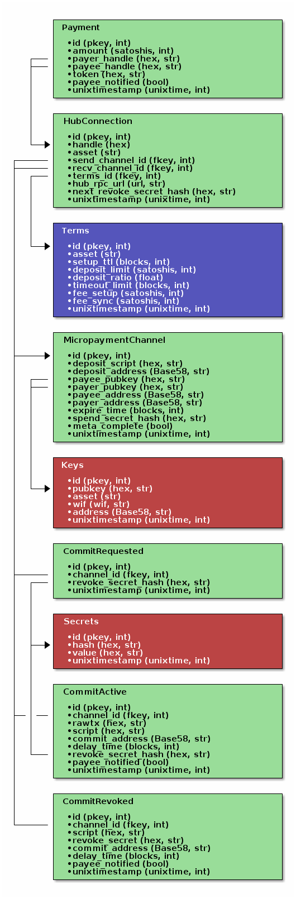

############
PicoPayments
############

|BuildLink|_ |CoverageLink|_ |LicenseLink|_ |IssuesLink|_

.. |BuildLink| image:: https://travis-ci.org/Storj/picopayments.svg
.. _BuildLink: https://travis-ci.org/Storj/picopayments

.. |CoverageLink| image:: https://coveralls.io/repos/Storj/picopayments/badge.svg
.. _CoverageLink: https://coveralls.io/r/Storj/picopayments

.. |LicenseLink| image:: https://img.shields.io/badge/license-MIT-blue.svg
.. _LicenseLink: https://raw.githubusercontent.com/F483/picopayments/master/LICENSE

.. |IssuesLink| image:: https://img.shields.io/github/issues/F483/picopayments.svg
.. _IssuesLink: https://github.com/F483/picopayments/issues

Decentral micropayment hub.

====================
Installation / Setup
====================

::

  TODO setup bitcoind full node
  TODO setup counterparty lib on localhost
  pip install picopayments

---------------------
Fast native functions
---------------------

There is experimental code that will call into OpenSSL for slow functions.
To enable this, set (and export) environment variable PYCOIN_NATIVE=openssl.

::

  $ export PYCOIN_NATIVE=openssl

=========
API Calls
=========

---------------
mpc_hub_clients
---------------

Audit hubs liquidity to determan if a transfer is likely to succeed.

Each entry is signed by the hub to prove it controls the keypair.

Optionally the entries can be limited to a set of provided clients and assets.

::

    Arguments: {
        "clients": ["pubkey"],
        "assets": ["asset"]
    }

    Response: [{
        "asset": "asset",
        "client_url": "url" or null,
        "client_deposit_script": "hex",
        "hub_balance": satoshis,
        "hub_deposit_script": "hex",
        "hub_signature": "hex"
    }]

---------------
mpc_hub_request
---------------

Exchange spend secrets and pubkeys for channel.

Channel culled if deposit not made fast enough.

::

    Arguments: {
        "asset": asset,
        "pubkey": "hex",
        "spend_secret_hash": "hex"
        "url": "url" or None
    }

    Response: {
        "channel_handle": "hex",
        "spend_secret_hash": "hex",
        "pubkey": "hex",
        "channel_terms": {
            "setup_ttl": seconds,
            "deposit_delay": blocks,
            "deposit_limit": satoshis,
            "deposit_ratio": float,
            "timeout_limit": blocks,
            "timeout_ratio": float,
            "fee_setup": satoshis,
            "fee_sync": satoshis
        }
    }

---------------
mpc_hub_deposit
---------------

Exchange depsoit scripts. Hub waits with funding deposit until client deposit is confirmed.

Hub will fund deposit according to the deposit ratio given in the terms.

Channel culled if client deposit not made fast enough.

::

    Arguments: {
        "channel_handle": "hex",
        "deposit_script": "hex",
        "unused_revoke_secret_hash": "hex"
    }

    Response: {
        "deposit_script": "hex",
        "unused_revoke_secret_hash": "hex"
    }

------------
mpc_hub_sync
------------

::

    Arguments: {
        "channel_handle": "hex",
        "send": [{"pubkey": "hex", "amount": satoshis, "token": "hex"}],
        "commit": { "rawtx": "hex", "script": "hex" },
        "revokes": ["secrets"],
        "unused_revoke_secret_hash": "hex"
    }

    Response: {
        "receive": [{"pubkey": "hex", "amount": satoshis, "token": "hex"}],
        "commit": { "rawtx": "hex", "script": "hex" },
        "revokes": ["hex"],
        "unused_revoke_secret_hash": "hex"
    }

=========
DB Schema
=========

